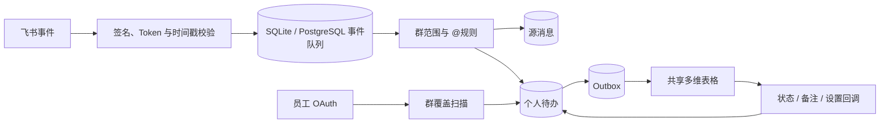

# Feishu Mentions Inbox

> 面向企业团队的飞书“个人 @收件箱”：把分散在多个内部群里的 @消息汇总成每位员工相互隔离、可追踪的个人待办。

[English](README_EN.md) · [文档导航](docs/README.md) · [设计方案](docs/design.md) · [轻量试点](docs/lite-pilot.md) · [快速开始](#快速开始) · [部署指南](docs/deployment.md) · [安全策略](SECURITY.md) · [参与贡献](CONTRIBUTING.md)


## 为什么需要它

当团队同时使用大量项目群、部门群和话题群时，重要的 @消息很容易被后续聊天淹没。普通机器人只能提供一个共享列表，而企业实际需要的是：

- 一条消息 @三个人时，三个人分别拥有自己的处理状态；
- 员工只能查看和修改属于自己的记录；
- 管理员能控制启用名单并看见群覆盖缺口；
- 多维表格不可用时消息仍保存在可靠的主数据源；
- 以后切换独立网页时，不需要重做消息采集和业务模型。

本项目以关系数据库作为主数据源，以飞书多维表格作为首版员工界面。默认 SQLite Lite 模式适合几名用户快速试用，PostgreSQL 模式保留给正式扩展部署。

> [!IMPORTANT]
> 项目目前为 `0.1.x Alpha`。代码已通过 SQLite、PostgreSQL 和 Docker 自动化验证，但真实飞书权限、三账号行级隔离及组织合规要求必须在你的预发布租户中验收后再上线。

## 核心能力

- **个人级待办**：直接 @多人时，为每位已启用且已授权员工创建独立待办。
- **可选 `@所有人`**：默认关闭；按当前群成员、个人开关和激活状态过滤，直接 @优先。
- **可靠去重**：源消息使用 `(tenant_key, message_id)`，个人待办使用 `(source_message_id, target_user_id)` 数据库唯一约束。
- **离线恢复**：事件队列和 outbox 使用数据库持久化，支持重试、并发投递和进程重启恢复。
- **双向同步**：状态、备注、个人设置和启用名单可从多维表格安全回写。
- **群覆盖管理**：汇总所有激活用户所在内部群的并集，识别已覆盖、待加机器人、无法覆盖和授权失效。
- **隐私生命周期**：不下载附件；正文默认保留 180 天；撤回立即清正文；OAuth Token 加密存储。
- **最小权限部署**：签名和回调凭证校验、生产配置门禁、非 root/只读容器、管理员接口双层保护。

## 工作方式



关键规则：

| 场景 | 行为 |
|---|---|
| 消息直接 @ A、B、C | 创建 3 条个人待办，状态互不影响 |
| 同一员工同时命中直接 @和 `@所有人` | 只创建 1 条，提及类型为“直接@我” |
| 员工未启用、未授权、已停用或已离职 | 不创建新待办 |
| `@所有人` | 仅分发给当前在群内且主动开启该选项的激活员工 |
| 重复或并发投递 | 数据库唯一约束保证不重复 |
| 消息撤回 | 清除正文；未完成待办转“忽略”，已完成状态保留 |
| 多维表格暂时不可用 | 数据保留在主数据库，恢复后由 outbox 补写 |

完整的业务与系统方案见 [设计方案](docs/design.md)，实现级细节见 [架构文档](docs/architecture.md)。

## 快速开始

### 1. 环境要求

- Docker Engine 24+ 与 Docker Compose v2；
- 一台可被飞书回调访问的 HTTPS 域名；
- 飞书企业自建应用管理权限；
- 一份支持高级权限的独立多维表格；
- 几名用户可直接使用默认 SQLite；扩大到正式团队时建议 PostgreSQL 16；
- 生产环境建议使用组织级密钥管理服务。

本地开发也可以使用 Python 3.11–3.13。

### 2. 准备配置

```bash
cp .env.example .env
```

Windows PowerShell：

```powershell
Copy-Item .env.example .env
```

编辑 `.env`，替换所有示例域名、`replace-me`、`xxxxxxxx` 和随机密钥。可以用 Python 生成独立随机值：

```bash
python -c "import secrets; print(secrets.token_urlsafe(48))"
```

`ADMIN_API_TOKEN`、`BITABLE_CALLBACK_TOKEN`、`OAUTH_STATE_SECRET` 和 `TOKEN_ENCRYPTION_SECRET` 必须分别生成，不能复用 App Secret。`.env` 已被 `.gitignore` 和 `.dockerignore` 排除。

### 3. 配置飞书

依次完成：

1. 按 [飞书应用配置](docs/feishu-setup.md) 创建企业自建应用、权限、事件订阅和 OAuth 回调；
2. 按 [多维表格配置](docs/bitable-setup.md) 创建四张表、高级权限角色和三条自动化；
3. 首次仅把应用可用范围开放给 3 个测试账号。

### 4. 启动

```bash
docker compose config --quiet
docker compose up -d --build
docker compose ps
```

以上命令默认启动单容器 SQLite Lite 模式。切换 PostgreSQL：

```bash
docker compose -f docker-compose.yml -f docker-compose.postgres.yml up -d --build
```

两种模式的限制、备份和切换说明见 [数据库模式](docs/database-backends.md)。

首次部署建议逐项执行 [SQLite 轻量试点与功能验证](docs/lite-pilot.md)，先用三个测试账号验证权限隔离和完整消息链路。

服务仅监听服务器本机 `127.0.0.1:8090`。请通过 HTTPS 反向代理公开必要路径。检查健康状态：

```bash
curl --fail https://mentions.example.com/healthz
```

预期返回：

```json
{"status":"ok","database":true}
```

生产部署、反向代理、备份、升级和告警建议见 [部署与运维](docs/deployment.md)。

## 用户开通流程

1. 管理员在“启用用户管理”表选择员工并勾选“启用”，或调用管理员 API。
2. 服务从通讯录确认稳定 `user_id`，向员工发送首次授权入口。
3. 员工完成 OAuth 后，服务授予多维表格文档访问和受限角色。
4. 服务同步员工当前内部群列表，开始收集此后的合规 @消息。
5. 群主把机器人加入缺失群，覆盖管理表自动更新。

管理员 API 示例：

```bash
curl --request POST https://mentions.example.com/admin/users \
  --header "Authorization: Bearer $ADMIN_API_TOKEN" \
  --header "Content-Type: application/json" \
  --data '{"user_id":"example-user-id"}'
```

`/admin/*` 除 Bearer Token 外，还必须在网关层限制为公司内网或管理员身份。

## 配置参考

### 应用与数据库

| 变量 | 必填 | 默认值 | 说明 |
|---|---:|---|---|
| `APP_ENV` | 是 | `development` | 生产必须为 `production` |
| `APP_HOST` | 否 | `0.0.0.0` | 容器内监听地址 |
| `APP_PORT` | 否 | `8090` | 容器内监听端口 |
| `PUBLIC_BASE_URL` | 是 | `http://localhost:8090` | 生产必须为 HTTPS，不带末尾 `/` |
| `DATABASE_URL` | `sqlite:////data/mentions.db` | — | SQLite 文件 URL；PostgreSQL 模式由 Compose 覆盖 |
| `POSTGRES_PASSWORD` | PostgreSQL 模式必填 | — | 数据库密码，使用 URL 安全字符 |
| `CONTENT_RETENTION_DAYS` | 否 | `180` | 正文保留天数 |
| `RUN_BACKGROUND_WORKERS` | 否 | `true` | 是否启动事件、outbox、覆盖与清理任务 |

### 服务端凭证

| 变量 | 用途 |
|---|---|
| `ADMIN_API_TOKEN` | 管理接口 Bearer Token |
| `BITABLE_CALLBACK_TOKEN` | 多维表格自动化回调 Bearer Token |
| `OAUTH_STATE_SECRET` | OAuth state 的 HMAC 密钥 |
| `TOKEN_ENCRYPTION_SECRET` | 数据库内 OAuth Token 的加密根密钥 |

以上四项在生产环境必须至少 32 个字符。完整飞书与 Base 变量见 [.env.example](.env.example)。

### 定时任务

| 变量 | 默认值 | 说明 |
|---|---:|---|
| `COVERAGE_INTERVAL_SECONDS` | `3600` | 群覆盖全量校验间隔 |
| `RECONCILIATION_INTERVAL_SECONDS` | `300` | 数据库与 Base 对账间隔 |
| `RETENTION_INTERVAL_SECONDS` | `3600` | 正文保留策略执行间隔 |
| `WORKER_POLL_SECONDS` | `1` | 队列空闲轮询间隔 |

## API

| 方法 | 路径 | 认证 | 用途 |
|---|---|---|---|
| `POST` | `/integrations/feishu/events` | 飞书签名、时间戳与 Verification Token | 接收加密事件 |
| `GET` | `/auth/feishu/start` | OAuth state | 发起员工授权 |
| `GET` | `/auth/feishu/callback` | OAuth code + state | 激活员工并建立群覆盖基线 |
| `POST` | `/integrations/bitable/status` | Bitable Bearer Token | 回写状态和备注 |
| `POST` | `/integrations/bitable/settings` | Bitable Bearer Token | 回写个人 `@所有人` 设置 |
| `POST` | `/integrations/bitable/users` | Bitable Bearer Token | 回写管理员启用名单 |
| `GET` | `/healthz` | 无 | 数据库健康检查；异常时返回 503 |
| `*` | `/admin/*` | Admin Bearer Token + 网关访问控制 | 用户和覆盖管理 |

开发环境可访问 `/docs` 和 `/redoc`；生产环境默认关闭 OpenAPI 和交互式文档。接口请求示例见 [API 文档](docs/api.md)。

## 数据、安全与隐私

本项目会处理企业内部通讯数据，安全边界比普通机器人更严格：

- 只保存文本/富文本的可读摘要；图片、文件和卡片不下载附件；
- App Secret、回调凭证和 OAuth Token 不写入日志；OAuth Token 加密后入库；
- 事件通过签名、Verification Token 和 5 分钟时间窗口校验；
- 无法确认群属性时拒绝继续处理，不把未知群默认视为内部群；
- 普通员工必须通过多维表格高级权限实现行级隔离；
- 第一版管理员技术上仍可查看全量记录；如要求管理员也不可见正文，应切换独立网页与端到端权限模型。

公开 issue 或 PR 时，禁止上传真实消息、群名、成员信息、租户 ID、Base ID、日志或凭证。完整的数据生命周期、威胁边界和上线核对项见 [隐私与安全设计](docs/privacy-and-security.md) 和 [SECURITY.md](SECURITY.md)。

## 测试与质量

安装开发依赖：

```bash
python -m pip install -e ".[dev]"
```

运行与 CI 一致的检查：

```bash
ruff format --check app tests
ruff check app tests
mypy app
pytest --cov=app
pip-audit
docker build -t feishu-mentions-inbox:local .
pre-commit run --all-files
```

GitHub Actions 会在 Python 3.11、3.12 和 3.13 上运行格式、Lint、类型检查和测试，并单独执行依赖审计与生产镜像构建。真实租户仍必须通过 [三账号验收清单](docs/acceptance-checklist.md)。

准备公开发布前，请执行 [GitHub 发布前检查清单](docs/github-release-checklist.md)。它包含凭证扫描、GitHub 安全功能、仓库描述与首个发布版本的检查项。

## 项目结构

```text
.
├── app/                     # FastAPI、飞书/Base 客户端、领域服务和后台任务
│   └── migrations/          # 随 Python 包发布的 SQLite/PostgreSQL 初始化迁移
├── tests/                   # 单元、API、同步和安全测试
├── docs/                    # 设计、架构、部署、配置、隐私和验收文档
├── .github/                 # CI、Dependabot、Issue 与 PR 模板
├── docker-compose.yml       # 默认 SQLite Lite 单容器部署
├── docker-compose.postgres.yml # PostgreSQL 叠加配置
├── Dockerfile               # 非 root 生产镜像
├── pyproject.toml           # 包元数据与开发工具配置
└── .env.example             # 不含真实凭证的配置模板
```

## 明确边界

- 只覆盖机器人已进入的内部群和内部话题群中的上线后新消息；
- 不补历史消息，不处理外部群、跨租户群、单聊和普通引用回复；
- 机器人加入前的消息无法恢复；
- SQLite Lite 仅支持本机磁盘上的单应用进程；多实例使用 PostgreSQL；
- 不构造飞书未公开的消息深链，只保存群名、发送人、时间和 `message_id` 定位信息；
- 单个 Base 高级权限角色存在人数和平台能力限制，超过约 200 人前应重新验证或切换独立网页；
- 当前推荐单应用实例；任务领取支持并发，但覆盖扫描尚未实现分布式领导锁。

## Roadmap

- [ ] 独立 Web 收件箱与移动端友好界面；
- [ ] 管理员不可见正文的更强隔离模式；
- [ ] Prometheus 指标、结构化日志和告警模板；
- [ ] 正式的版本化数据库迁移与零停机升级；
- [ ] SQLite 到 PostgreSQL 的受支持迁移命令；
- [ ] 更大规模的分片角色和限流压测报告；
- [ ] 国际版 Lark 兼容性验证与完整英文部署文档。

建议通过 Feature Request 讨论路线图优先级。项目欢迎设计、测试、文档和代码贡献，详见 [CONTRIBUTING.md](CONTRIBUTING.md)。

## License 与声明

本项目使用 [MIT License](LICENSE)。

“飞书”“Feishu”“Lark”及相关标识属于其各自权利人。本项目为独立开源项目，与飞书或字节跳动不存在隶属、背书或官方合作关系。部署方需要自行遵守飞书平台条款、企业制度及适用的数据保护法律。
