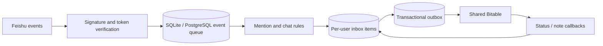

# Feishu Mentions Inbox

> A self-hosted, multi-user inbox that turns mentions scattered across internal Feishu/Lark group chats into private, trackable tasks for each employee.

[中文文档](README.md) · [Documentation index](docs/README.md) · [Design proposal](docs/design.md) · [Deployment](docs/deployment.md) · [Security](SECURITY.md) · [Contributing](CONTRIBUTING.md)


## What it solves

Important mentions disappear quickly when a team works across many group chats. A shared bot feed is not enough: each employee needs an isolated inbox, while administrators need rollout controls and visibility into chats the bot cannot cover.

Feishu Mentions Inbox uses SQLite or PostgreSQL as the source of truth and a shared Bitable as the first user interface. SQLite Lite is the default for a small pilot; PostgreSQL remains available for scaled deployments. A message that mentions three enabled users creates three independent tasks.

> [!IMPORTANT]
> This project is currently `0.1.x Alpha`. Automated and container integration tests pass, but every deployment must validate real Feishu permissions and Bitable row-level isolation with at least three accounts before production use.

## Highlights

- Independent per-user tasks for direct multi-user mentions.
- Optional `@everyone` collection, disabled by default and filtered by current membership.
- Database-enforced idempotency for duplicate and concurrent event delivery.
- Durable database event and outbox queues with retry and restart recovery.
- Bidirectional Bitable status, note, setting, and allowlist synchronization.
- OAuth activation and union coverage checks for all enabled users' internal chats.
- Recall handling, encrypted OAuth tokens, and configurable 180-day body retention.
- Signed event verification, replay window, non-root containers, and production config gates.

## Architecture



See the Chinese [design proposal](docs/design.md), detailed [architecture](docs/architecture.md), [privacy and security model](docs/privacy-and-security.md), and [Feishu](docs/feishu-setup.md) / [Bitable](docs/bitable-setup.md) setup guides.

## Quick start

Requirements: Docker Engine 24+, Docker Compose v2, an HTTPS callback domain, a Feishu custom app, and a standalone Bitable with advanced permissions.

```bash
cp .env.example .env
# Replace every placeholder and generate separate random server secrets.
docker compose config --quiet
docker compose up -d --build
curl --fail https://mentions.example.com/healthz
```

This starts the single-container SQLite Lite mode. For PostgreSQL:

```bash
docker compose -f docker-compose.yml -f docker-compose.postgres.yml up -d --build
```

See [database backends](docs/database-backends.md) for limitations, backups, and switching guidance.

The expected health response is `{"status":"ok","database":true}`. The app binds to `127.0.0.1:8090` on the host; expose only the required routes through an HTTPS reverse proxy.

## Development

```bash
python -m venv .venv
source .venv/bin/activate
python -m pip install -e ".[dev]"
ruff format --check app tests
ruff check app tests
mypy app
pytest --cov=app
pre-commit run --all-files
```

CI tests Python 3.11–3.13, audits dependencies, and builds the production image. Read [CONTRIBUTING.md](CONTRIBUTING.md) before opening a pull request. Never include real messages, user/chat/tenant IDs, logs, app tokens, or secrets in issues and test fixtures.

Before making a repository public, follow the [GitHub release checklist](docs/github-release-checklist.md).

## Scope and limitations

- New messages only; no history backfill.
- Internal group and topic-group chats only; no DMs, external chats, or ordinary replies.
- The bot must already be a member of a chat to receive its events.
- Attachments are not downloaded; only message type and a readable summary are stored.
- Bitable administrators can technically see all rows in this first version.
- A single application replica is recommended until the coverage scanner gains leader election.

## License and trademark notice

Released under the [MIT License](LICENSE).

Feishu, Lark, and related marks belong to their respective owners. This independent open-source project is not affiliated with, endorsed by, or sponsored by Feishu or ByteDance. Deployers are responsible for platform terms, organizational policies, and applicable data-protection law.
