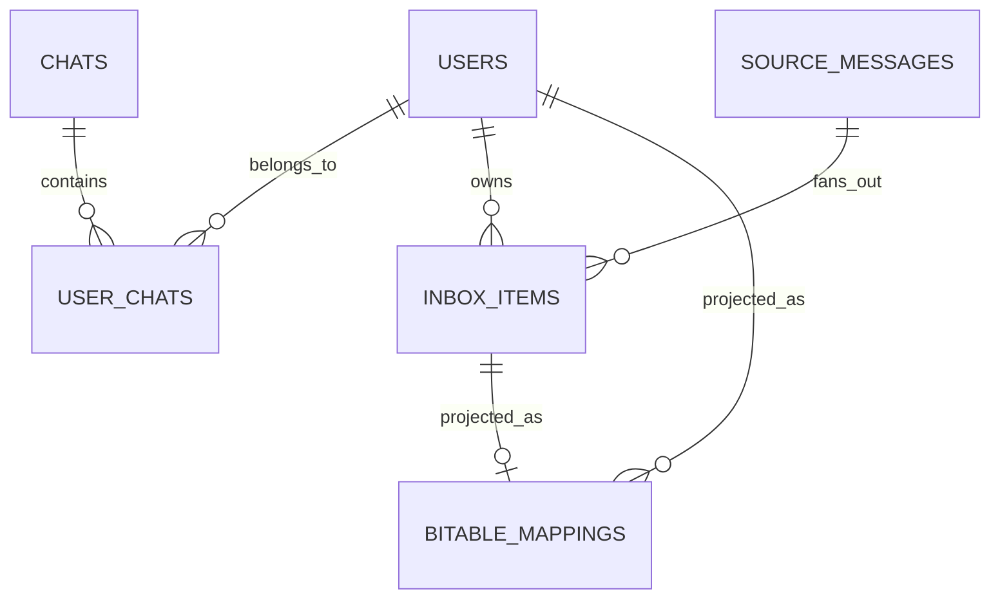
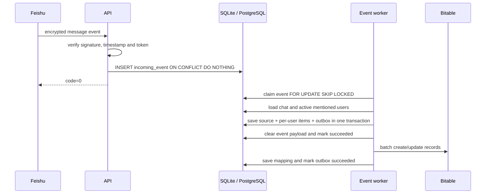

# 架构设计

## 设计目标

系统的核心目标不是“复制群消息”，而是为管理员已启用且本人已授权的员工建立可靠、相互隔离的个人 @待办。设计遵循以下原则：

1. 配置的关系数据库是唯一主数据源，多维表格只是可替换的投影视图；
2. 飞书事件按至少一次投递处理，所有写入必须幂等；
3. 一条源消息只保存一次，个人状态按目标员工拆分；
4. 外部系统失败不能导致消息丢失或跨用户状态污染；
5. 无法确认群属性或用户身份时不采集正文；
6. 数据保留、消息撤回和用户停用必须能收敛到明确状态。

## 组件

| 组件 | 职责 |
|---|---|
| FastAPI API | 飞书事件、OAuth、Base 回调、健康检查和管理员接口 |
| Event worker | 从持久化事件队列领取任务，执行消息、撤回和群生命周期规则 |
| Mention processor | 判断群范围，解析直接 @与 `@所有人`，生成个人目标集合 |
| Repository | SQLite 单实例事务或 PostgreSQL 并发事务、唯一约束、Token 加密字段和任务领取 |
| Outbox worker | 把数据库状态批量创建或更新到四张 Base 表 |
| Coverage worker | 计算激活用户内部群并集和机器人覆盖状态 |
| Reconciliation worker | 拉取 Base 状态变化，修复遗漏回调并避免同步循环 |
| Retention worker | 清理超过保留期或已撤回的消息正文 |

## 数据模型

| 表 | 关键约束 |
|---|---|
| `users` | `(tenant_key, user_id)` 唯一；`open_id` 仅在非空时唯一 |
| `chats` | `(tenant_key, chat_id)` 唯一 |
| `user_chats` | `(user_pk, chat_pk)` 唯一，保存每人覆盖状态 |
| `source_messages` | `(tenant_key, message_id)` 唯一，一条源消息只存一份 |
| `inbox_items` | `(source_message_id, target_user_id)` 唯一 |
| `bitable_mappings` | 每个实体/表唯一映射到一个 Base record |
| `incoming_events` | `event_key` 唯一，防止重复事件入队 |
| `outbox_jobs` | `idempotency_key` 唯一，防止重复投影任务 |

租户内稳定的 `user_id` 用于业务身份，应用相关的 `open_id` 用于飞书 API 和成员字段。

## 消息处理时序

API 先持久化再快速确认，使飞书回调不依赖后续 Base 可用性。PostgreSQL 使用 `FOR UPDATE SKIP LOCKED` 领取任务；SQLite Lite 使用单连接和 `BEGIN IMMEDIATE` 串行领取。进程重启时，残留的 `processing` 任务会恢复为可重试状态。

## @规则

1. 忽略单聊、外部群、已解散群和人工标记无法覆盖的群；
2. 从事件 `mentions` 中收集直接提及，只匹配激活用户；
3. 若存在 `@所有人`，实时读取群成员，并与用户群关系、个人开关和激活状态取交集；
4. 目标集合以内部用户 UUID 去重，直接 @先写入，因此优先于 `@所有人`；
5. 在一个数据库事务中写源消息、个人待办和 outbox。

群信息查询失败会让任务进入重试，不会把未知群默认视为内部群。

## 一致性与冲突

- Database → Base：transactional outbox 记录需要投影的实体版本，批量写入失败后指数退避；
- Base → Database：自动化携带内部 ID、版本和最后修改时间；
- 相同状态和备注被视为幂等成功，不再产生 outbox；
- 版本不一致且没有更晚修改时间时拒绝写入；
- 定时对账扫描 Base，以数据库映射确认记录归属，修复自动化漏发；
- 同一批 outbox 中，同实体只保留最新投影。

系统提供最终一致性，不提供主数据库与 Base 之间的分布式事务。

## 故障语义

| 故障 | 行为 |
|---|---|
| 飞书重复事件 | `event_key` 与业务唯一约束共同去重 |
| 主数据库不可用 | 回调失败，健康检查返回 503，由飞书重试 |
| Base 5xx/限流 | outbox 保留并退避重试，不丢主数据 |
| 应用重启 | 启动时恢复 processing 事件和 outbox |
| OAuth 过期 | 标记用户授权失效并停止宣称覆盖完整 |
| 机器人退群/群解散 | 事件即时更新，小时级扫描再次校验 |
| 消息撤回 | 正文立即清空，开放待办转忽略 |

## 扩展边界

SQLite Lite 必须运行一个应用进程。PostgreSQL 的事件与 outbox 领取支持多进程并发，但覆盖扫描、Token 刷新和定时对账尚未设置分布式领导锁。横向扩容前应：

- 为周期任务加入 PostgreSQL advisory lock 或独立调度器；
- 加入 Feishu/Base API 的租户级速率限制和抖动退避；
- 将 migration 从启动时执行升级为正式版本化工具；
- 增加 Prometheus 指标、结构化日志和队列深度告警；
- 评估 Base 角色人数与记录容量，必要时切换独立 Web 前端。
