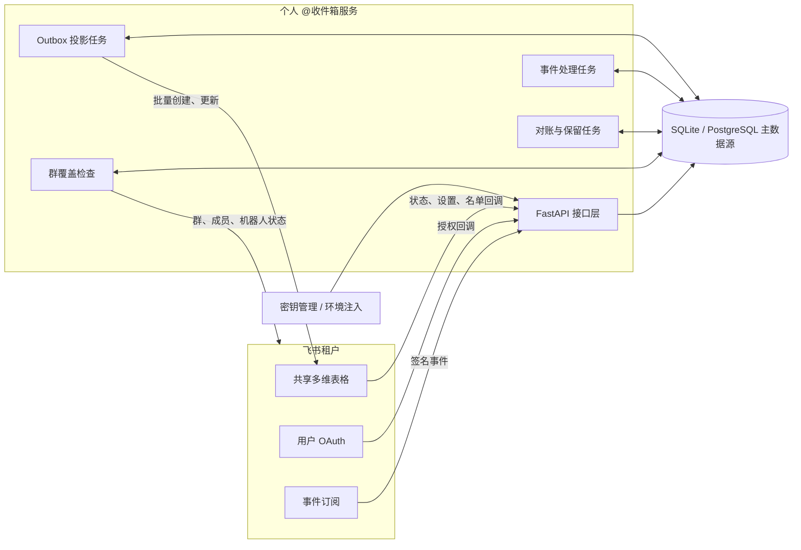
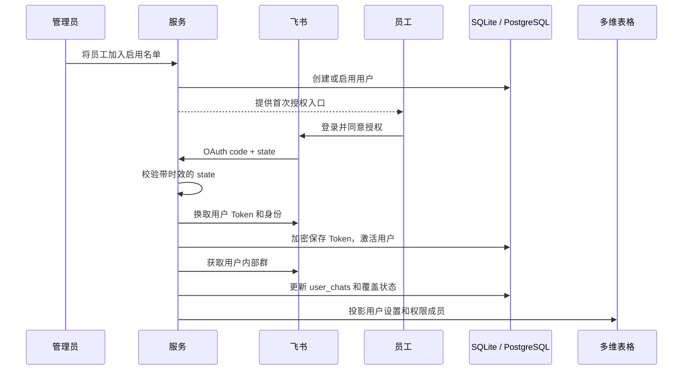
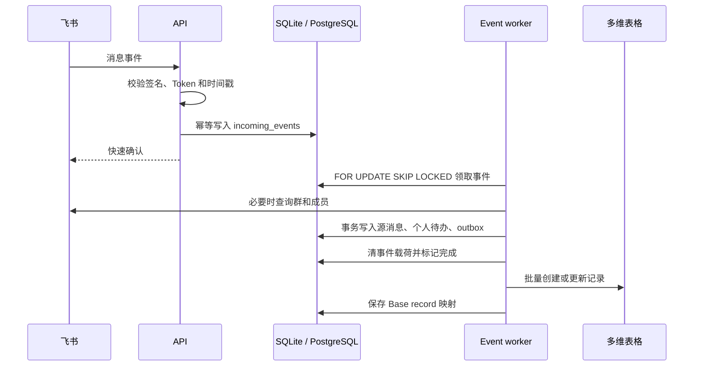
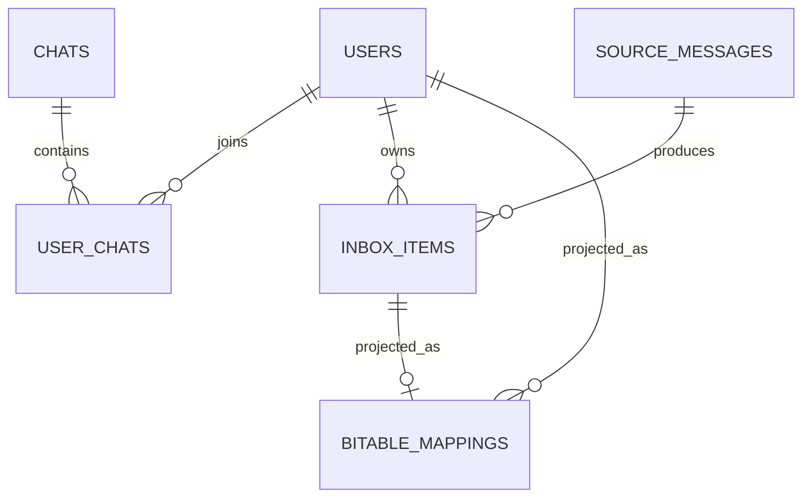
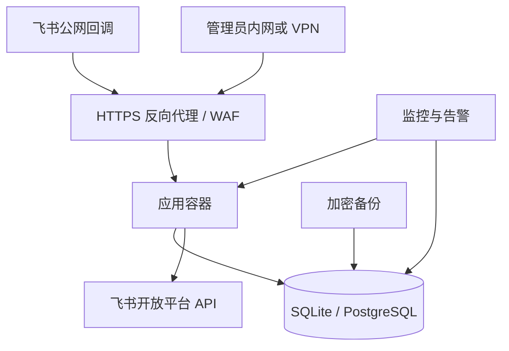

# 企业级飞书“个人 @收件箱”设计方案

> 文档版本：0.1
> 项目阶段：Alpha / 试点前
> 适用规模：首期约 100～200 名员工
> 设计基线：内部群、上线后的新消息、共享多维表格展示层

## 1. 执行摘要

本项目把散落在飞书内部群中的 @消息，转换成每位员工相互隔离、可以独立处理的个人待办。管理员维护启用名单，员工完成一次飞书 OAuth 授权后，系统开始覆盖该员工所在且机器人可加入的内部群。

一条消息同时 @三个人时，数据库只保存一份源消息，但创建三条独立待办。任何一人的状态、备注和处理时间都不会影响其他人。配置的 SQLite 或 PostgreSQL 是唯一主数据源，多维表格只是第一版员工界面；未来更换为独立网页时，不需要迁移业务模型。

本方案将“覆盖全部群”严格定义为：**所有已启用且已授权用户所在内部群的并集**。它不代表租户内所有群，也不承诺补录机器人加入前的历史消息。

## 2. 背景与目标

### 2.1 需要解决的问题

- 群聊数量多，重要 @消息容易被后续聊天淹没；
- 同一条消息可能对应多位责任人，不能共享一个处理状态；
- 普通员工不应看到其他员工的个人待办；
- 机器人无法天然覆盖租户内全部群，需要持续暴露覆盖缺口；
- 多维表格可能限流或暂时不可用，但消息不能因此丢失；
- 后续需要独立网页、提醒和统计能力，不能把业务逻辑绑定在 Base 自动化里。

### 2.2 成功目标

1. 符合规则的新消息通常在 60 秒内出现在个人收件箱；
2. 重复事件、并发投递和服务重启不会产生重复待办；
3. 普通用户只能读取和修改自己的记录；
4. 多维表格故障时主数据仍然可靠保存，恢复后可以补写；
5. 管理员能看见用户授权状态和群覆盖缺口；
6. 正文到期或源消息撤回后能按规则清除。

### 2.3 首版不做

- 不采集外部群、跨租户群、单聊和普通引用回复；
- 不补录机器人入群前的历史消息；
- 不下载图片、文件或其他附件；
- 不生成依赖未公开接口的飞书消息深链；
- 不承诺管理员无法查看全量内容；共享多维表格管理员在首版技术上可见；
- 不将多维表格作为事务数据库或唯一数据源。

## 3. 用户与权限角色

| 角色 | 主要操作 | 数据边界 |
|---|---|---|
| 普通员工 | 完成授权、查看个人 @、修改状态和备注、设置是否包含 `@所有人` | 仅本人记录和本人设置 |
| 业务管理员 | 启用或停用员工、推进机器人入群、查看覆盖状态 | 首版可管理共享 Base 并查看全量记录 |
| 系统管理员 | 部署、密钥、数据库、备份、监控和故障处理 | 受公司运维与审计制度约束 |
| 飞书群主 | 将机器人加入目标内部群 | 仅影响其管理的群 |

用户必须同时满足“管理员已启用、未离职、OAuth 授权有效”三个条件，才属于激活用户。停用或授权失效后不再创建新待办，历史记录按照保留策略留存。

## 4. 核心业务规则

### 4.1 不可破坏的业务不变量

- 一条飞书源消息在同一租户只保存一次；
- 一个目标用户对一条源消息最多拥有一条待办；
- 个人待办状态只能影响该目标用户；
- 无法确认群为内部群时，不采集正文；
- 未启用、未授权、已停用或已离职用户不接收新待办；
- 同一用户同时命中直接 @和 `@所有人` 时，按“直接@我”处理；
- Base 写入失败不能回滚或丢弃主数据库中已经接收的消息。

### 4.2 消息分发矩阵

| 场景 | 是否创建待办 | 提及类型 |
|---|---:|---|
| 内部群直接 @激活用户 | 是 | 直接@我 |
| 内部群直接 @未启用或未授权用户 | 否 | — |
| 内部群 `@所有人`，用户在群且已开启开关 | 是 | @所有人 |
| 用户同时被直接 @且命中 `@所有人` | 仅一条 | 直接@我 |
| 外部群、单聊、普通引用回复 | 否 | — |
| 机器人入群前的历史消息 | 否 | — |

### 4.3 撤回规则

- 立即清除源消息正文并标记“源消息已撤回”；
- 尚未完成的待办自动转为“忽略”；
- 已处理记录保留原处理状态，便于审计已经发生的工作；
- Base 投影通过 outbox 最终同步到新状态。

## 5. 总体架构



### 5.1 组件职责

| 组件 | 职责 |
|---|---|
| API 服务 | 校验飞书事件、OAuth 回调、Base 回调、健康检查和管理员请求 |
| 事件任务 | 领取持久化事件，解析消息、撤回和群生命周期事件 |
| Mention processor | 计算直接 @与 `@所有人` 的目标用户集合 |
| Repository | SQLite 单实例事务或 PostgreSQL 并发事务、唯一约束、任务领取和主数据 |
| Outbox 任务 | 将数据库中的最新实体版本批量投影到四张 Base 表 |
| Coverage 任务 | 计算激活用户内部群并集，检查机器人覆盖状态 |
| Reconciliation 任务 | 修复 Base 自动化漏发、乱序和同步循环造成的偏差 |
| Retention 任务 | 清除过期、撤回或无需继续保留的消息正文和事件载荷 |

## 6. 关键流程

### 6.1 用户开通与 OAuth



OAuth state 带签名和有效期，Refresh Token 加密后入库。授权失效时，用户保持在启用名单中但退出激活集合，并显示“需要重新授权”。

### 6.2 消息接收与个人待办拆分



API 只负责可靠接收，不在回调请求中等待完整业务处理，从而把飞书重试、Base 限流和业务处理解耦。

### 6.3 Base 状态回写

1. 员工只修改自己的“处理状态”和“处理备注”；
2. Base 自动化发送带共享凭证的 HTTPS 请求；
3. 服务根据内部 UUID 找到记录，并校验目标用户、允许字段和版本；
4. 相同值视为幂等成功；旧版本或越权记录拒绝更新；
5. 数据库更新后生成最新投影，Base 再次回调时不会形成无限循环；
6. 定时对账作为自动化漏发的兜底。

## 7. 数据设计



| 数据表 | 用途 | 核心约束 |
|---|---|---|
| `users` | 身份、启用/授权/离职状态、个人开关、加密 Token | `(tenant_key, user_id)` 唯一 |
| `chats` | 群属性、机器人状态、解散和不支持原因 | `(tenant_key, chat_id)` 唯一 |
| `user_chats` | 用户所在群及覆盖状态 | `(user_pk, chat_pk)` 唯一 |
| `source_messages` | 每条飞书源消息一份 | `(tenant_key, message_id)` 唯一 |
| `inbox_items` | 源消息与目标用户的个人待办关系 | `(source_message_id, target_user_id)` 唯一 |
| `bitable_mappings` | 业务实体与 Base record 的映射 | 实体/表与 record 均唯一 |
| `incoming_events` | 可靠事件收件箱 | `event_key` 唯一 |
| `outbox_jobs` | 外部投影任务、重试和错误信息 | `idempotency_key` 唯一 |

业务身份使用租户内稳定的 `user_id`，`open_id` 仅用于应用相关 API 和 Base 成员字段。消息正文不写入应用日志；Token 不以明文保存。

## 8. 多维表格产品设计

### 8.1 个人 @收件箱

| 字段 | 类型 | 员工权限 | 说明 |
|---|---|---|---|
| 目标用户 | 成员 | 只读 | 行级权限依据 |
| 群名、发送人 | 文本 | 只读 | 定位来源 |
| 提及类型 | 单选 | 只读 | 直接@我 / @所有人 |
| 正文 | 多行文本 | 只读 | 文本或附件摘要 |
| 发送时间 | 日期时间 | 只读 | 源消息时间 |
| 处理状态 | 单选 | 可编辑 | 待处理 / 处理中 / 已处理 / 忽略 |
| 处理备注 | 多行文本 | 可编辑 | 个人处理说明 |
| 处理时间 | 日期时间 | 只读 | 后端统一生成 |
| 源状态 | 单选 | 只读 | 有效 / 已撤回 / 已过期 |
| 内部 ID、版本 | 文本/数字 | 隐藏只读 | 回写、幂等和对账 |

### 8.2 个人设置

每人一行，包含用户、是否包含 `@所有人`、授权状态、群覆盖率和最后检查时间。普通员工只能查看和修改自己的 `@所有人` 开关。

### 8.3 群覆盖管理

仅管理员可见，展示群、关联用户、内部/外部属性、机器人状态、覆盖状态、最后检查时间和建议动作。外部群、跨租户群和禁止机器人加入的群标为“不纳入首版”。

### 8.4 启用用户管理

仅管理员可见，用于新增、停用、重新启用和分批 rollout。名单回调只接受允许字段，并由管理员回调凭证保护。

## 9. 群覆盖模型

```text
目标群集合
= 所有激活用户的内部群集合并集
- 外部/跨租户群
- 已解散群
- 明确不支持或禁止机器人加入的群
```

每个用户—群关系独立保存，群级机器人状态共享。状态建议统一为：

| 状态 | 含义 | 建议动作 |
|---|---|---|
| 已覆盖 | 机器人已在群中，可以接收后续事件 | 无 |
| 待加机器人 | 目标内部群，但机器人尚未加入 | 联系群主加入 |
| 无法覆盖 | 外部群或平台/组织策略禁止 | 记录原因，不纳入覆盖率 |
| 授权失效 | 无法确认该用户的群集合 | 用户重新授权 |

机器人进群、退群和群解散事件用于即时更新；周期任务每小时全量校验，纠正漏事件或人工变更。

## 10. API 与信任边界

| 接口组 | 调用方 | 主要保护 |
|---|---|---|
| `/integrations/feishu/events` | 飞书事件平台 | 签名、verification token、时间戳、防重复 |
| `/auth/feishu/*` | 员工浏览器、飞书 OAuth | 带签名时效 state、授权名单校验 |
| `/integrations/bitable/*` | Base 自动化 | HTTPS、共享回调凭证、字段白名单、记录归属 |
| `/admin/*` | 公司管理员 | Bearer Token，并建议叠加内网/VPN/网关身份 |
| `/healthz` | 容器平台、负载均衡 | 不返回秘密；数据库不可用时返回 503 |

生产环境默认关闭 OpenAPI、Swagger UI 和 ReDoc。完整字段与示例见 [API 文档](api.md)。

## 11. 安全与隐私

- App Secret、回调凭证、OAuth state secret 和 Token 加密密钥仅通过密钥管理注入；
- Refresh Token 和 Access Token 加密后入库，日志进行正文与 Token 脱敏；
- 容器使用非 root 用户、只读根文件系统、移除 Linux capabilities；
- 正文默认保留 180 天，撤回立即清除，期限可由管理员调整；
- 不下载附件，只保存类型和可读摘要；
- 普通用户的隔离依赖 Base 高级权限，必须用至少三个真实账号验证查看、搜索、导出和编辑边界；
- 公开 issue、日志和截图不得包含群名、成员、消息正文、tenant key、Base ID 或真实凭证。

详细威胁模型与上线清单见 [隐私与安全设计](privacy-and-security.md) 和项目根目录的 [安全策略](../SECURITY.md)。

## 12. 一致性、重试与故障语义

| 故障 | 系统行为 |
|---|---|
| 飞书重复投递 | 事件键和业务唯一约束共同去重 |
| 两个任务并发处理 | 行锁领取与唯一约束保证最终只有一份业务数据 |
| 主数据库不可用 | 健康检查返回 503，飞书回调失败并由平台重试 |
| Base 5xx 或限流 | outbox 指数退避，主数据不丢失 |
| 服务异常重启 | 启动时恢复残留的 processing 事件和 outbox |
| OAuth 失效 | 停止宣称覆盖完整，提示用户重新授权 |
| 回调重复或乱序 | 内部 ID、版本和最后修改时间实现幂等收敛 |
| 消息撤回 | 清正文，开放待办转忽略，保留已处理状态 |

主数据库与 Base 之间采用最终一致性，不尝试建立分布式事务。

## 13. 容量与性能基线

首期容量假设为 100～200 名员工、数百个内部群，并允许大群 `@所有人` 的短时突发。设计采用以下控制方式：

- 事件先入库再异步处理，回调延迟不依赖 Base；
- 群成员结果只用于当前分发，并与激活用户集合取交集；
- Base 创建和更新批量执行，失败后带抖动退避；
- 事件和 outbox 使用 `SKIP LOCKED`，为后续多 worker 并发预留空间；
- 正文保留期控制数据库长期增长；
- 应监控 pending 数量、最老任务年龄、API 限流、OAuth 失效用户和覆盖缺口。

SQLite Lite 必须运行一个应用进程。PostgreSQL 模式横向扩容周期任务前，应增加 advisory lock 或独立调度器，避免重复执行覆盖扫描和对账。

## 14. 部署拓扑



最低生产要求包括可信 HTTPS 域名、网络时间同步、独立数据库账号、加密备份、密钥轮换、管理员接口网络限制和恢复演练。具体步骤见 [部署指南](deployment.md)。

## 15. 测试与验收策略

### 15.1 自动化层

- 单元测试：签名、防重放、内容解析、@规则、配置门禁；
- 数据库集成测试：迁移、多人拆分、去重和状态隔离；
- 静态质量：Ruff format/check、MyPy；
- 依赖安全：pip-audit 与 Dependabot；
- 镜像验证：非 root 用户、健康检查、迁移资源和最小运行时。

### 15.2 真实租户门禁

1. 三个测试账号验证 A 无法读取、搜索、导出或修改 B 的记录；
2. 一条消息同时 @三人时生成三条独立待办；
3. 未启用、未授权和已停用用户均不产生新待办；
4. `@所有人` 只分发给在群内且主动开启的激活用户；
5. 机器人被移出、群解散和 OAuth 失效时覆盖状态正确；
6. Base 暂停后消息仍入库，恢复后完成补写；
7. 重复和乱序回调不会覆盖更晚状态；
8. 任一权限隔离测试失败，都不得进入生产 rollout。

可执行清单见 [验收清单](acceptance-checklist.md)。

## 16. 上线计划

| 阶段 | 用户规模 | 退出条件 |
|---|---:|---|
| 预发布 | 3 个测试账号 | 权限隔离、消息规则和回写全部通过 |
| 小范围试点 | 10～20 人 | 目标群覆盖缺口清零或明确豁免，运行稳定 |
| 扩展试点 | 约 50 人 | 限流、队列、恢复和支持流程满足要求 |
| 首期上线 | 100～200 人 | 分批名单、覆盖、备份、监控和回滚均就绪 |

每批上线前必须处理“待加机器人”群，或由管理员明确记录无法覆盖原因。上线期间不能把覆盖率中的排除项表述为已经采集。

## 17. 关键设计决策

| 决策 | 选择 | 原因 |
|---|---|---|
| 主数据源 | SQLite Lite 或 PostgreSQL | 小规模低成本启动，同时保留事务、约束、可靠队列和扩展路径 |
| 首版界面 | 共享多维表格 | 降低试点成本，员工无需学习新系统 |
| 消息模型 | 源消息一份 + 每人一条待办 | 兼顾存储效率和个人状态隔离 |
| 事件处理 | 持久化收件箱 + 异步 worker | 抵抗重复投递、重启和外部系统故障 |
| Base 同步 | Transactional outbox + 定时对账 | 不让 Base 可用性决定主数据可靠性 |
| 群覆盖 | 激活用户内部群并集 | 符合平台约束，也能准确表达覆盖边界 |
| `@所有人` | 每人默认关闭 | 降低噪音与隐私范围，由用户主动选择 |
| 历史消息 | 首版不补录 | 机器人入群前缺少可靠实时事件和完整上下文 |

## 18. 后续演进

1. 独立 Web 前端复用现有用户、消息、待办和覆盖模型；
2. Base 降级为管理视图或可选导出；
3. 加入站内提醒、摘要、SLA、过滤和统计；
4. 使用正式迁移工具和周期任务领导锁支持多实例；
5. 增加 Prometheus 指标、结构化审计事件和容量告警；
6. 当要求管理员也不能看正文时，引入独立前端、字段级加密和更严格的密钥边界；
7. 经过真实流量验证后，再评估附件代理、消息跳转和历史导入。

## 19. 文档导航

- [文档导航](README.md)：按部署、配置、验收或公开发布目标选择文档；
- [架构设计](architecture.md)：实现级组件、时序、一致性和故障语义；
- [API 文档](api.md)：接口、鉴权、请求和响应；
- [部署指南](deployment.md)：生产配置、反向代理、备份和升级；
- [数据库模式](database-backends.md)：SQLite Lite 与 PostgreSQL 的选择、限制和切换；
- [轻量试点](lite-pilot.md)：几名用户的部署和真实功能验证步骤；
- [飞书配置](feishu-setup.md)：应用权限、事件订阅和 OAuth；
- [多维表格配置](bitable-setup.md)：字段、高级权限和自动化；
- [隐私与安全设计](privacy-and-security.md)：数据生命周期和威胁边界；
- [验收清单](acceptance-checklist.md)：试点和上线门禁。
- [GitHub 发布前检查清单](github-release-checklist.md)：脱敏、提交审阅与仓库安全设置。
